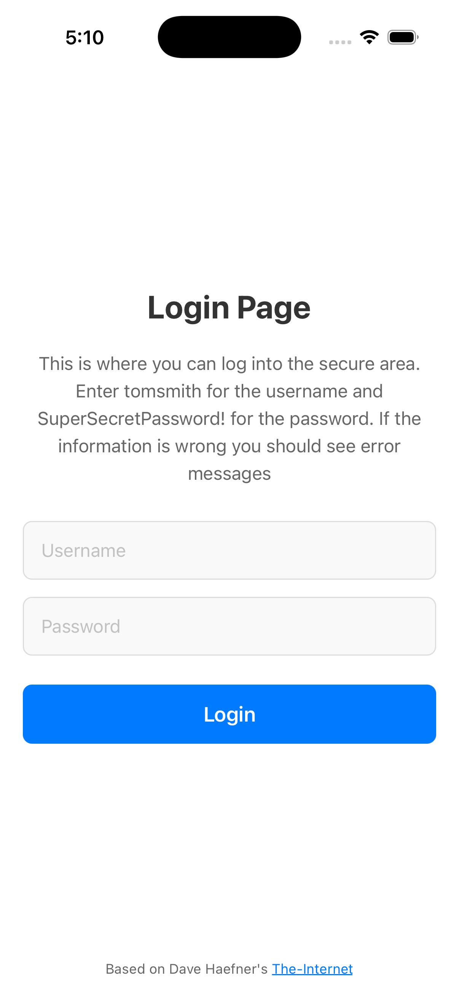
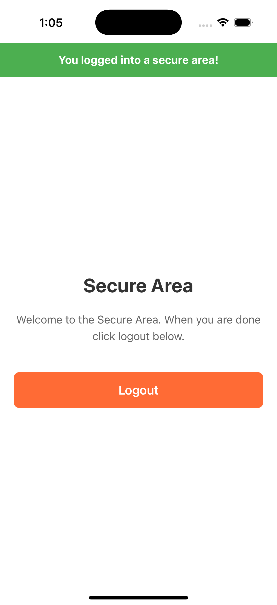

# Detox Demo - React Native iOS App

DetoxDemo is a working React Native demo app that gives examples of:
* [Mobile automation tests](https://github.com/tjmaher/detox-demo/blob/main/e2e/login.test.ts) written in Detox + TypeScript 
* Commonly used test code refactored into [Page Objects](https://github.com/tjmaher/detox-demo/tree/main/e2e/pages)
* Common methods used by Page Objects refactored into a [Base Page](https://github.com/tjmaher/detox-demo/blob/main/e2e/pages/base-page.ts)
* Log reports published after a test run, written like a manual test plan testers can follow
* Pre-written yarn scripts to build and test stored in a [package.json](https://github.com/tjmaher/detox-demo/blob/main/package.json)
* detox-allure2-adapter set up in [.detoxrc.js](https://github.com/tjmaher/detox-demo/blob/main/.detoxrc.js) and the [e2e/jest.config.js](https://github.com/tjmaher/detox-demo/blob/main/e2e/jest.config.js)
* [Allure Reports](https://tjmaher.github.io/detox-demo/ios/) configured to show historical data
* CI/CD provided by [GitHub Action workflow](https://github.com/tjmaher/detox-demo/actions/workflows/ios-regression.yml)
* A working React Native mobile app for iOS [complete with source code](https://github.com/tjmaher/detox-demo/tree/main/src)
* A detailed README documenting the Project Structure, and all the setup for the tools and technologies of this project, along with listing various historical tidbits. 
* Scalable Vector Graphic (SVG) showing the DetoxDemo [iPhone desktop icon](https://github.com/tjmaher/detox-demo/tree/main/assets) and a [setup script](https://github.com/tjmaher/detox-demo/tree/main/scripts) generating various sizes of icons

Want to kick off a job to run all the Login tests in the CI/ CD platform using our GitHub Actions workflow?
* Go to Actions -> [View all Workflows](https://github.com/tjmaher/detox-demo/actions)
* Under the **Actions** column to the left, select [Build & Test iOS](https://github.com/tjmaher/detox-demo/actions/workflows/ios-regression.yml)
* Select the **\[Run workflow\]** button to see all the choices I set up in the [ios-regression.yml](https://github.com/tjmaher/detox-demo/blob/main/.github/workflows/ios-regression.yml) configuration file under the on: workflow_dispatch -> inputs
* Say you were a developer that wanted to test out their JIRA-123 branch code before merging, under "Use workflow from" they could choose branch JIRA-123 here instead of running against the main branch.
* Which test suite would you like to run? Login? SecureArea? Default is "all".
* Which iPhone 16 would you like to run the tests on? Regular iPhone 16, Pro, or Pro Max? Or maybe an iPad Mini, Air, or Pro? 
* What log level? Select any range from the very verbose "trace", to throw alerts if things are "fatal". Default is "info".
* What level of artifacts do you want to capture for logs, screenshots, or videos? All, just failing, or none?
* Do you want to run performance testing with Detox Instruments? We have that option! Still looking how the Wix Incubator's [Detox Instruments](https://github.com/wix-incubator/DetoxInstruments) works with CI/CD. 
* Or you can just scroll down to the bottom and select **\[Run Workflow\]** and kick off the default values set up in [ios-regression.yml](https://github.com/tjmaher/detox-demo/blob/main/.github/workflows/ios-regression.yml)
* A new "Build & Test iOS" run will be created. Feel free to click into the run to see it run through the build -> test -> publish-allure-reports -> cleanup stages where you can see all Homebrew, RubyGems, Cocoapods, Node.js, and Applesimutils are configured and run.
* If you click into the "build" stage, you can see it work through tasks such as "Set up job", "Checkout repository", "Setup Homebrew", "Setup Ruby", "Cache Homebrew and RubyGems", etc. It takes 30 minutes for a Detox-embedded build to be generated. 
* When everything is finished, you can see in the run downloadable artifacts such as videos, logs, screenshots, and the allure-report. 
* You can also view the Allure Reports at [https://tjmaher.github.io/detox-demo/ios/]


<div align="center">

<table>
<tr>
<td width="50%" style="padding: 10px;">



*Login Page*

</td>
<td width="50%" style="padding: 10px;">



*Secure Area*

</td>
</tr>
</table>

</div>

T.J. Maher will be using DetoxDemo to demonstrate to the [AutomationGuild](https://testguild.com/) in April 2026 how he has put together a mobile automated test framework for [SELF ID](https://selfid.com/) and their React Native mobile application.  

The DetoxDemo app is based on Dave Haefner's [The - Internet / Login](http://the-internet.herokuapp.com/login), a site where T.J. first started teaching himself automation development, writing Selenium + Java tests against that website back in July 2015 with his first toy automation project "Testing The-Internet" ([See Blog](https://www.tjmaher.com/2015/06/simple-manipulation-of-login-page.html)). 

DetoxDemo uses Wix's [Detox](https://wix.github.io/Detox/), a grey-box end-to-end automated testing framework built to test React Native applications. Reports are produced via [Allure Reports](https://allurereport.org/) by integrating The Wix Community's [detox-allure2-reporter](https://github.com/wix-incubator/detox-allure2-adapter). CI/CD Test reports produced by a GitHub Actions workflow are published at [https://tjmaher.github.io/detox-demo/ios/](https://tjmaher.github.io/detox-demo/ios/). 

DetoxDemo, the app under test for this project, was constructed by GitHub CoPilot via prompts from T.J. Maher. The automation framework was lovingly crafted by hand, with locators artisinally wrapped in page objects by T.J. Maher. You can read more about the hectic journey T.J. had with GitHub CoPilot creating the app under test in T.J.'s LinkedIn article: [First Time Using GitHub CoPilot to Create a ReactNative LoginPage app. What Could Go Wrong?](https://www.linkedin.com/pulse/first-time-using-github-copilot-create-reactnative-app-maher-jr--1iaoe/)

T.J. has been a Software Test Engineer at [SELF ID](https://selfid.com/) since July 2025 testing the SELF ID React Native mobile app ( [Download iOS app](https://apps.apple.com/us/app/self-id/id1663745416) ) where users can create, store, and share their digital identity. 

T.J. Maher has been blogging about writing test automation for over ten years on his site, [Adventures in Automation](https://www.tjmaher.com/2015/06/simple-manipulation-of-login-page.html), writing [toy projects](https://www.tjmaher.com/p/programming-projects.html) to help him practice what he is doing on the job, and writing [articles](https://www.tjmaher.com/p/media.html) and [courses](https://testautomationu.applitools.com/capybara-ruby/) about test automation. Other coding projects can be found at https://github.com/tjmaher . T.J. is @tjmaher1 on [BlueSky](https://bsky.app/profile/tjmaher1.bsky.social), [LinkedIn](https://www.linkedin.com/in/tjmaher1/), and [Twitter](https://x.com/tjmaher1).

If you find this project helpful, feel free to copy it and use it for your own education. Like it? Give a shout out and tag me [on LinkedIn](https://www.linkedin.com/in/tjmaher1/)! 

## Features

### Login Screen
- **Heading**: "Login Page"
- **Instructions**: Guided instructions with username and password information
- **Username Input**: Text input for username (use "tomsmith")
- **Password Input**: Secure text input for password (use "SuperSecretPassword!")
- **Login Button**: Triggers authentication
- **Error Banner**: Red banner with white bold text for invalid credentials: "Your username is invalid!"
- **Success Messages**: Green banners illustrating a successful logout.

### Secure Area Screen
- **Heading**: "Secure Area" 
- **Welcome Text**: "Welcome to the Secure Area. When you are done click logout below."
- **Success Banner**: Green banner with "You logged into a secure area!"
- **Logout Button**: Returns to login screen with success message

### Navigation Flow
1. Login Screen → (valid credentials) → Secure Area Screen
2. Secure Area Screen → (logout) → Login Screen (with logout success message)
3. Login Screen → (invalid credentials) → Error message display

### Test Reporting
- **Allure Reports**: Comprehensive test reports with visual artifacts for debugging
- **Live Results**: View test execution results at https://tjmaher.github.io/detox-demo/ios/
- **CI Integration**: Automated report generation on GitHub Actions with iPhone 16 Pro simulator
- **Failure Artifacts**: Screenshots, videos, and logs captured

## Test Credentials
- **Username**: `tomsmith`
- **Password**: `SuperSecretPassword!`

## Tools & Technologies

### React Native

React Native is an open-source framework created by Facebook - now Meta - for building mobile applications using JavaScript and the React library, a JavaScript library released in March 2013, also produced by Facebook, to create user interfaces for web applications. React Native was first released for iOS in March 2015 with the Android version in September 2015. 

### Yarn

This project uses [yarn](https://yarnpkg.com/) as a package manager. Yarn is a JavaScript package manager, developed by Facebook in 2016. Facebook had found npm (Node Package Manager) installed packages sequentially, causing bottlenecks. Yarn implemented parallel downloads, reducing installation times. (See [Yarn: A new package manager for JavaScript](https://engineering.fb.com/2016/10/11/web/yarn-a-new-package-manager-for-javascript/) on Engineering at Meta, October 2016.)

### Detox

Wix's Detox, first released in 2016, is an open-source, gray-box end-to-end (E2E) test automation framework, created at first to test Wix's own React Native mobile application that customers used to create their own websites. Features of Detox include:

* Gray-Box Testing: Unlike "black-box" tools, Detox accesses the app's internal state to monitor asynchronous tasks like network requests, animations, and timers.
* Automatic Synchronization: It automatically waits for the app to be idle before executing the next test action, which eliminates "flakiness" and the need for manual sleep/wait commands.
* Cross-Platform: Supports both iOS and Android, allowing developers to write E2E tests in JavaScript that run on simulators, emulators, and real devices.
* Native Integration: It relies on native drivers (like Espresso for Android and EarlGrey for iOS) to interact directly with the app's native layers.

### Detox CLI

Detox CLI is the command-line interface tool for Detox, the end-to-end testing framework for mobile apps (React Native, iOS, and Android). It provides commands to build apps, run tests, manage test devices/simulators, and configure your testing environment. First released by Wix on March 15, 2017.

Example Detox CLI command:
```
detox test --configuration ios.sim.debug --loglevel info --artifacts-location artifacts --record-logs failing --take-screenshots failing --record-videos none --record-performance none
```

### Detox-Allure2-Adapter

Still in the Alpha stage, detox-allure2-adapter is a bridge between Detox (the mobile E2E testing framework) and jest-allure2-reporter, enables integration of Allure reporting with Detox tests, providing reports with screenshots, videos, device logs, and view hierarchies. The adapter replaces Detox's built-in artifacts manager to integrate with Allure's reporting capabilities.

### Allure Reports

The Allure Framework, created as an internal product by Yandex that was open-sourced, and is now maintained by Qameta Software. According to an [article on Habr.com](https://habr.com/ru/companies/yandex/articles/232697/), published on Yandex's company blog in 2014, they wanted a way to make the automation results transparent not just to the automation engineers, but the entire testing team to make sure that the automation closely match the original manual tests. 

## Project Structure

```
detox-demo/
├── src/
│   └── screens/
│       ├── LoginScreen.tsx       # Login Page emulating The-Internet
│       └── SecureAreaScreen.tsx  # Secure Area reached after successful login
│
├── e2e/                          # Detox end-to-end testing framework
│   ├── pages/                    # Page Objects
│   │   ├── base-page.ts          # Base page object with common methods
│   │   ├── login-page.ts         # Login screen page object
│   │   └── secure-area-page.ts   # Secure area page object
│   ├── constants.ts              # Time constants (TEN_SECONDS, FIVE_SECONDS, etc.)
│   ├── credentials.ts            # Test credentials (tomsmith/SuperSecretPassword!)
│   ├── init.ts                   # Detox initialization and setup
│   ├── jest.config.js            # Jest configuration for Detox tests with Allure integration
│   ├── login.test.ts             # Login functionality test suite
│   └── securearea.test.ts        # Secure area test suite
│
├── .github/
│   └── workflows/
│       └── ios-regression.yml    # CI/CD pipeline with iPhone 16 Pro simulator
│
├── ios/                          # iOS native project files and Xcode configuration
│   ├── build/                    # Xcode build output (generated)
│   │   └── Build/Products/Debug-iphonesimulator/
│   │       └── DetoxDemo.app     # Built app for Detox testing
│   └── DetoxDemo/
│       └── Images.xcassets/
│           └── AppIcon.appiconset/ # Custom app icons
│
├── scripts/
│   └── generate-tj-icon.js       # Icon generation script 
│
├── assets/                       # Static assets and resources
│   └── app-icon.svg              # SVG source for app icon generation
│
├── artifacts/                    # Detox test artifacts (generated on test failures)
│   ├── attachments/              # Device logs from failed tests
│   └── ios.sim.debug.*/          # Per-test-run artifacts (screenshots, videos, logs)
│
├── allure-results/              # Allure test results JSON files
├── allure-report/               # Generated Allure HTML reports (local and CI)
│
├── node_modules/                # Node.js dependencies 
├── .detoxrc.js                  # Detox configuration targeting iPhone 16 Pro simulator
├── jest.config.js               # React Native unit tests configuration
├── package.json                 # Dependencies and yarn scripts for detox:ios commands
├── yarn.lock                    # Locked dependency versions
├── Gemfile                      # Ruby dependencies for CocoaPods
├── Gemfile.lock                 # Locked Ruby gem versions
└── README.md                    
```

## Setup & Installation

### Prerequisites
- Node.js (>= 20)
- Xcode (for iOS development)
- iOS Simulator (such as iPhone 16 Pro, used in this project)
- React Native development environment ([Setup Guide](https://reactnative.dev/docs/set-up-your-environment))
- Homebrew (for macOS dependencies)

### Install Dependencies

```bash
# Install Node.js dependencies
yarn install

# Install Ruby dependencies for CocoaPods
bundle install
```

### iOS Setup

**Install [CocoaPods](https://cocoapods.org/) dependencies:**
* cd ios && pod install && cd ..

**Install [Detox CLI](https://wix.github.io/Detox/docs/19.x/api/detox-cli/) globally:**
* yarn global add detox-cli

**Install [applesimutils](https://github.com/wix/AppleSimulatorUtils), for Detox iOS testing:**
* brew tap wix/brew
* brew install applesimutils


### Detox Setup
```bash
# Build the iOS app for testing
yarn detox:build:ios

# Run Detox tests on iPhone 16 Pro simulator
yarn detox:test:ios
```

### Allure Reporting Setup (Optional)
```bash
# Install Allure CLI for local report generation
brew install allure

# Generate and view reports locally after running tests
allure generate allure-results --clean -o allure-report
allure open allure-report
```

### Verify Installation
You can also run the complete test suite to verify everything is working, via shortcuts I placed in the package.json:
```bash
# Build and test in one command
yarn detox:ios
```

You should see your app running in iOS Simulator with tests.

# Getting Started

[Set Up Your React Native Environment](https://reactnative.dev/docs/set-up-your-environment) before proceeding.

## Step 1: Start Metro

Run **Metro**, the JavaScript build tool for React Native.

To start the Metro dev server, run:

```sh
# Using yarn
yarn start

```

## Step 2: Build your app

Open a new terminal from the root of your React Native project.

### iOS

For iOS, install CocoaPods dependencies:

Run the Ruby bundler to install CocoaPods itself:

```sh
bundle install
```

Build a version of the app with Detox embedded:

```sh
detox build --configuration ios.sim.debug
```

For more information, visit [CocoaPods Getting Started guide](https://guides.cocoapods.org/using/getting-started.html).

## Step 3: Run the Tests Locally

Run all the tests: 
* detox test --configuration ios.sim.debug

Run only the LoginPage tests in login.test.ts: 
* detox test --configuration ios.sim.debug e2e/login.test.ts

... Or you can run shortcuts to run the tests, found in the package.json file in the root directory such as:

* yarn detox:test:ios
 
 ```sh
 "detox:build:ios": "detox build --configuration ios.sim.debug",
 "detox:test:ios": "detox test --configuration ios.sim.debug",
 "detox:ios": "yarn run detox:build:ios && yarn run detox:test:ios"
```

To run one of the shortcuts, add the command "yarn" plus the shortcut:
* Run all the tests on an iOS emulator in debug mode: yarn detox:test:ios

Detox has a REPL mode, a Run - Evaluate - Print Loop where you can investigate your running app. For more information, see [Wix Detox: Debugging with Detox REPL](https://wix.github.io/Detox/docs/guide/detox-repl)

Let's say you wanted to run all failing LoginPage tests in REPL mode:
* detox test --configuration ios.sim.debug e2e/login.test.ts --repl=auto

Some things you can do in REPL Mode:
```
.detox> .help
.break     Sometimes you get stuck, this gets you out
.dumpxml   Print view hierarchy XML
.exit      Exit the REPL
.help      Print this help message
```


You should see your new app running in iOS Simulator.

  Login Flow
  ```
    ✓ Verify Heading and Instruction Text (1550 ms)
    ✓ Invalid credentials displays error message (3958 ms)
    ✓ Successful login to Secure Area displays success message (5159 ms)
    ✓ Logout from Secure Area returns to Login Page (5779 ms)

    Test Suites: 1 passed, 1 total
    Tests:       4 passed, 4 total
    Snapshots:   0 total
    Time:        27.516 s, estimated 39 s
  ```  

## Test Reports

At the end of each test, a test report is outputed to the console log. A test report looks like a manual test plan a software tester can use to debug any failures:

```
==Secure Area Flow:  Verify all Secure Area elements==
 
LoginPage: Verifying Page is Loaded
LoginPage: Logging in as tomsmith / SuperSecretPassword!
 
LoginPage: Verifying Page is Loaded
  * Entering Username: tomsmith
  * Entering Password: SuperSecretPassword!
  * Tapping Login Button
 
SecureArea: Verifying Page is Loaded
  * Verifying Heading: 'Secure Area'
  * Verifying Body Text
  * Expected Text: Welcome to the Secure Area. When you are done click logout below.
  * Verifying Success Banner
  * Expected Text: You logged into a secure area!
  * Verifying Logout Button is Visible
 ================================
 ```

## More about the GitHub Actions Workflow CI/CD Pipeline 

The GitHub Actions Workflow Pipeline is configured by [.github/workflows/ios-regression.yml](https://github.com/tjmaher/detox-demo/blob/main/.github/workflows/ios-regression.yml).

It takes 30 minutes to build the Detox app and 10 minutes to set up the simulator and run all tests. 

### Pipeline Stages
1. **Build Stage**: Sets up macOS environment, installs dependencies (Node.js 20, Ruby 3.2, CocoaPods), and builds the iOS app for default iPhone 16 Pro simulator
2. **Test Stage**: Boots default iPhone 16 Pro simulator running Detox tests collecting artifacts such as screenshots, videos, logs
3. **Allure Report Stage**: Generates HTML test reports, deploying to GitHub Pages at https://tjmaher.github.io/detox-demo/ios/
4. **Cleanup Stage**: Removes temporary files and shuts down simulators

### Key Features
- **Triggered on**: Push to main, pull requests, manual dispatch with test suite selection
- **iPhone 16 Pro Focus**: Uses iPhone 16 Pro simulator if default is selected
- **Failure Handling**: Each stage only runs if prerequisites succeed, with proper error handling
- **Visual Artifacts**: Captures screenshots and videos using Wix's [detox-allure2-adapter](https://github.com/wix-incubator/detox-allure2-adapter)
- **Live Reports**: Publishes test results to GitHub Pages for easy access


# Troubleshooting

If you're having issues see the [Troubleshooting React Native application](https://reactnative.dev/docs/troubleshooting) page.

## Test Reporting with Allure

This project uses [detox-allure2-adapter](https://github.com/wix-incubator/detox-allure2-adapter) to generate visual test reports with screenshots, videos, and logs captured on test failures.

### Key Features
- **HTML Reports**: Rich test execution reports with pass/fail details
- **Visual Artifacts**: Screenshots and videos captured only on failures
- **Device Logs**: iOS simulator logs for debugging
- **CI Integration**: Automatic report generation and deployment

### Configuration
The adapter is configured in `.detoxrc.js` and `e2e/jest.config.js` to capture artifacts on failing tests and generate results in `allure-results/`.  

### Viewing Reports

**Local Development:**
```bash
brew install allure
allure generate allure-results --clean -o allure-report
allure open allure-report
```

**CI/CD Pipeline:**
View live reports at: https://tjmaher.github.io/detox-demo/ios/

The GitHub Actions workflow automatically runs tests, captures failure artifacts, and publishes reports to GitHub Pages for easy access to test results and debugging

## What is Metro?

**Metro** is the JavaScript bundler for React Native applications, the build tool that transforms React Native code into JavaScript bundles that can run on iOS and Android devices.

### Key Functions in DetoxDemo

**Development Server**: Metro runs a local development server on port 8081, that serves your JavaScript code to the iOS Simulator during development and testing.

**Code Transformation**: Converts modern JavaScript/TypeScript, JSX, and React Native components into optimized JavaScript that iOS can execute.

**Hot Reloading**: Enables fast development by automatically updating your app when you make code changes without losing app state.

**Bundle Generation**: Creates production-ready JavaScript bundles for release builds.

### Metro in Your Detox Tests

When running Detox tests, Metro must be running to serve your app's JavaScript code to the iOS Simulator:

```bash
# Metro starts automatically with this command
yarn start

# Or start with cache reset for clean testing
yarn start --reset-cache
```

### Common Metro Issues

**"No script URL provided"**: This error occurs when:
- Metro bundler isn't running during test execution
- iOS app can't connect to Metro server
- JavaScript bundle isn't embedded in the app for CI

**Port Conflicts**: Metro defaults to port 8081. If blocked:
```bash
# Start Metro on different port
yarn start --port 8082
```
## Detox Instruments

DetoxInstruments, part of the [Wix Incubator](https://github.com/wix-incubator/DetoxInstruments), is a macOS performance profiling tool from Wix for iOS apps. It captures CPU, memory, disk, network, and FPS metrics during app execution.

### Key Features
* Visual timeline of performance metrics
* Integration with Detox test execution
* Automated performance regression detection in CI/CD
* Usage in DetoxDemo
* The [Build & Test iOS](https://github.com/tjmaher/detox-demo/actions/workflows/ios-regression.yml) GitHub Actions workflow has a record_performance option.

When set to 'all', it records performance profiles to help identify:
* Slow UI interactions
* Memory leaks
* Network bottlenecks
* App startup time issues